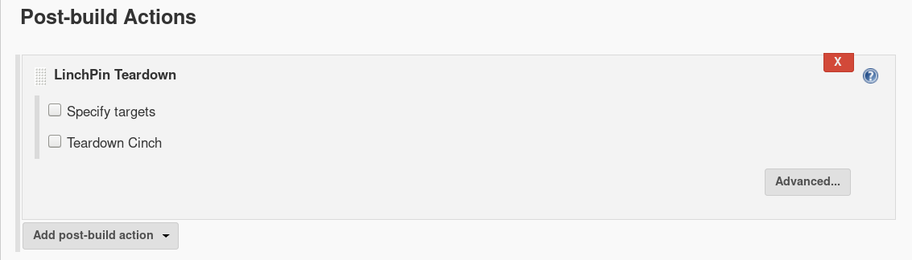

# Jenkins LinchPin Plugin

   
This plugin integrate [LinchPin](https://github.com/CentOS-PaaS-SIG/linchpin) with Jenkins.

## Usage

### LinchPin Installation 
Select **`"Install automatically"`** > **`"Add Installer"`** > **`"LinchPin Installer"`**.
 
 
  
### Build Environment 
Select **`"Use LinchPin"`** then find your LinchPin and copy&paste your PinFile.  
  
 
  

### Build  
Select **`"Add build step"`** > **`"LinchPin Up"`**.  

  

### Post-build Actions  
**Very Important!** Select **`"Add post-build action"`** > **`"LinchPin TearDown"`**
If not selected LinchPin will continue to run! 

## Adding Layout & Topology files  
For adding layout & topology files select **`"This project is parameterized"`** on **`"General"`**.  
Then **`"Add Parameter"`** > **`"File Parameter"`**.  

**Adding layout file** - on the **`"File location"`** enter first _`"layouts/"`_ then the file name you want it to be called, **don't forget the file extention!** 
 
 

**Adding topology file** - on the **`"File location"`** enter first _`"topologies/"`_ then the file name you want it to be called, **don't forget the file extention!**
 
 

**Common Error :** entering _`"/layouts/yourFile.yml"`_ **won't work!** > use _`"layouts/yourFile.yml"`_ instead (without the first '/').  

